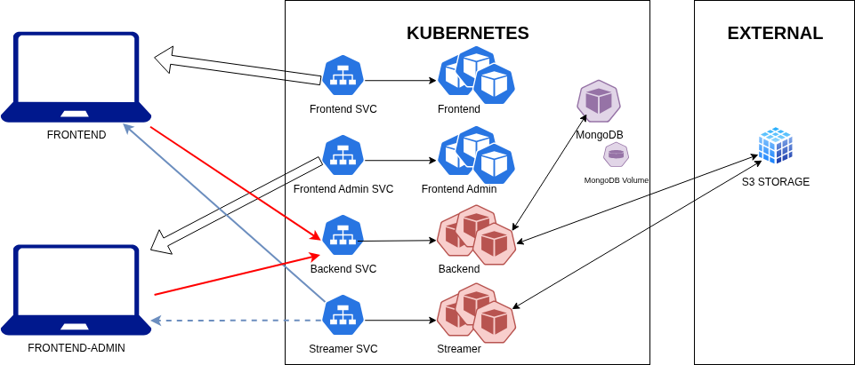

# Déploiement complet de Ginflix sur kind

Ce document explique comment créer un cluster kind from scratch, déployer toute la stack Ginflix à l’aide de plusieurs manifestes spécialisés et vérifier son bon fonctionnement. Les sections suivantes reprennent également la structure de chaque manifeste.



---

## 1. Prérequis

- Docker, kind et kubectl installés et disponibles dans le PATH.
- Accès aux fichiers fournis dans ce dépôt :
  - Images Docker exportées : `ginflix-backend.tar`, `ginflix-streamer.tar`, `ginflix-frontend.tar`, `ginflix-frontend-admin.tar`.
  - Manifestes Kubernetes :
    - `ginflix-namespace-config.yaml`
    - `ginflix-services.yaml`
    - `ginflix-statefulsets.yaml`
    - `ginflix-deployments.yaml`
    - `ginflix-hpa.yaml`
  - Configuration kind : `kind-config.yaml`
- Aucun cluster kind existant nommé `ginflix`.

> Nettoyage si besoin :
>
> ```bash
> kubectl get namespace ginflix 
> kubectl delete namespace ginflix --wait # uniquement si le namespace existe déjà
> kind get clusters
> kind delete cluster --name ginflix  # uniquement si le cluster existe déjà
> ```
>

---

## 2. Procédure complète depuis zéro

Toutes les commandes ci-dessous sont à lancer depuis la racine de votre projet (par exemple pour moi : `/home/bnj/Kubernetes/project`).

### Étape 1 — Charger les images Docker locales

```bash
docker load -i ginflix-backend.tar
docker load -i ginflix-streamer.tar
docker load -i ginflix-frontend.tar
docker load -i ginflix-frontend-admin.tar
```

### Étape 2 — Créer le cluster kind

Le fichier `kind-config.yaml` ouvre les ports 30080-30083 vers votre machine hôte.

```bash
kind create cluster --name ginflix --config kind-config.yaml
```

### Étape 3 — Copier les images dans le cluster

```bash
kind load docker-image --name ginflix ginflix-backend:latest
kind load docker-image --name ginflix ginflix-streamer:latest
kind load docker-image --name ginflix ginflix-frontend:latest
kind load docker-image --name ginflix ginflix-frontend-admin:latest
```

### Étape 4 — Appliquer les manifestes dans l’ordre recommandé

1. **Namespace, ConfigMaps et Secrets**

   ```bash
   kubectl apply -f ginflix-namespace-config.yaml
   ```

2. **Services (ClusterIP & NodePort)**

   ```bash
   kubectl apply -f ginflix-services.yaml
   ```

3. **StatefulSets (Mongo)**

   ```bash
   kubectl apply -f ginflix-statefulsets.yaml
   ```

4. **Deployments (Backend, Streamer, Frontaux)**

   ```bash
   kubectl apply -f ginflix-deployments.yaml
   ```

5. **Horizontal Pod Autoscalers**

   ```bash
   kubectl apply -f ginflix-hpa.yaml
   ```

### Étape 5 — Vérifier MongoDB (réplique `rs0`)

- Attendez que le pod `mongo-0` soit `Running` et `Ready` (`kubectl get pods -n ginflix`).
- Le StatefulSet déclenche automatiquement `rs.initiate(...)` au démarrage. Pour confirmer :

  ```bash
  kubectl exec -n ginflix mongo-0 -- \
    mongosh --quiet --eval 'rs.status().ok'
  ```

  La commande doit renvoyer `1`.

### Étape 6 — Vérifications essentielles

- **Pods**

  ```bash
  kubectl get pods -n ginflix
  ```

  Tous doivent être `Running` (backend, streamer, frontaux, mongo).

- **Services et NodePorts**

  ```bash
  kubectl get svc -n ginflix
  ```

  Les NodePorts `30080` (front), `30081` (backend), `30082` (streamer), `30083` (front admin) doivent apparaître.

- **Tests rapides**

  ```bash
  curl http://localhost:30081/api/videos
  curl -I http://localhost:30080
  curl -I http://localhost:30083
  curl -I 'http://localhost:30082/stream?file=test'
  ```

### Étape 8 — Test fonctionnel

1. Accédez à `http://localhost:30083`, uploadez une vidéo (le backend déclenche la conversion puis l’upload vers votre stockage Garage/S3 externe).
2. Sur `http://localhost:30080`, la vidéo apparaît avec sa miniature (servie par le streamer via `http://localhost:30082`).
3. Surveillez les logs si nécessaire :

   ```bash
   kubectl logs -n ginflix deployment/ginflix-backend
   kubectl logs -n ginflix deployment/ginflix-streamer
   ```

---

## 3. Structure des manifestes

### 3.1 `ginflix-namespace-config.yaml`

- Crée le namespace `ginflix`.
- ConfigMap `ginflix-config` (URI Mongo, endpoint Garage externe avec SSL désactivé par défaut — passez `GARAGE_USE_SSL` à `"true"` si votre endpoint accepte HTTPS, désactivation auth).
- Secret `ginflix-garage-credentials` (clé/secret S3).

### 3.2 `ginflix-services.yaml`

- Service headless `mongo` (`clusterIP: None`).
- Services NodePort pour backend (30081), streamer (30082), front (30080), front admin (30083) afin d’exposer l’application via les `extraPortMappings` kind.

### 3.3 `ginflix-statefulsets.yaml`

- StatefulSet `mongo` : base Mongo 6.0 en mode replica set `rs0`, PVC de 5 Gi, initialisation automatique du replica set via un hook `postStart`.

### 3.4 `ginflix-deployments.yaml`

- Deployments backend et streamer (3 réplicas chacun) : le backend demande 300m CPU / 512Mi et peut monter à 4 vCPU / 2Gi (pour encaisser ffmpeg), le streamer reste à 150m / 128Mi avec une limite à 400m / 256Mi. Les pods consomment ConfigMap + Secret pour Mongo et Garage.
- Deployments frontaux : URLs backend/streamer surchargées vers `http://localhost:30081` / `http://localhost:30082` pour contourner l’absence de DNS `*.svc` côté navigateur.

### 3.5 `ginflix-hpa.yaml`

- Deux HPAs (`autoscaling/v2`) pour backend et streamer : min 3 pods, max 6, cible 60 % d’utilisation CPU. Ils reposent sur les requests définies dans les déploiements.

---

## 4. Dépannage rapide

| Symptôme | Diagnostic | Correctif |
| --- | --- | --- |
| Front affiche « NetworkError » | Les scripts front consomment un backend injoignable (ex. URL interne `*.svc`). | Vérifiez les variables d'environnement des pods frontaux (`kubectl exec … -- printenv BACKEND_URL`) : elles doivent pointer vers `http://localhost:30081` / `http://localhost:30082`. |
| Erreur backend « Endpoint url cannot have fully qualified paths » | `GARAGE_ENDPOINT` contient un schéma (`http://…`). | Supprimez le schéma (`http://`/`https://`) dans la ConfigMap et réappliquez `ginflix-namespace-config.yaml`, puis redémarrez backend & streamer. |
| HPA ne scale pas | Pas de metrics server ou requests CPU manquantes. | Installez metrics-server sur kind et conservez les `requests` définies dans `ginflix-deployments.yaml`. |
| Backend redémarre (OOMKilled) | La conversion ffmpeg dépasse 512Mi. | Les manifestes fixent désormais la limite à 1Gi (backend). Réappliquez `ginflix-deployments.yaml`. |
| Pods en `ImagePullBackOff` | Images absentes des nœuds kind. | Refaire les commandes `kind load docker-image --name ginflix …`. |

---
